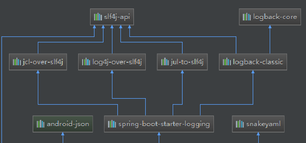
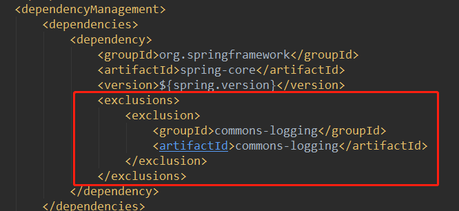

## 配置文件的优先级
* 由高到低

> 项目根目录下的config下的application.properties
> 项目根目录下的application.properties
> resources文件夹下的config下的application.properties
> resources文件夹下的application.properties

## springboot与日志
####	默认使用slf4j和logback
slf4j是日志抽象层
logback是日志实现

####  不同日志实现的如何统一到slf4j？
	commons-logging 替换为jcl-over-slf4j.jar
	log4j替换为log4j-over-slf4j.jar
	logging 替换为 jul-slf4j.jar

* 如果引入其他框架，一定要将框架的日志记录包移除掉

* 指定日志的生成位置
		logging.file=G:/springboot.log

## Springboot与web开发

### springboot对静态资源的映射规则
 * 在webjars包下的所有资源 
 * classpath: /META_INF/resources/
 * classpath: /resources
 * classpath: /static
 * classpath: /public
 * /： 当前项目根路径

### 欢迎页：静态资源文件夹下的

* index.html

### 配置喜欢的title的图标

* 所有**/favicon.ico

## 模板引擎
 JSP、freemarker、thymeleaf

### 引入thymeleaf
	<dependency>
			<groupId>org.springframework.boot</groupId>
			<artifactId>spring-boot-starter-thymeleaf</artifactId>
	</dependency>
	--覆盖默认配置
	<properties>
		<java.version>1.8</java.version>
		<thymeleaf.version>3.0.2.RELEASE</thymeleaf.version>
		<thymeleaf-layout-dialect.version>2.1.1</thymeleaf-layout-dialect.version>
	</properties>

### thymeleaf使用&语法
		@ConfigurationProperties(prefix = "spring.thymeleaf")
		public class ThymeleafProperties {
		    private static final Charset DEFAULT_ENCODING = Charset.forName("UTF-8");
		    private static final MimeType DEFAULT_CONTENT_TYPE = MimeType.valueOf("text/html");
		    public static final String DEFAULT_PREFIX = "classpath:/templates/";//前缀
		    public static final String DEFAULT_SUFFIX = ".html";//后缀

* 第一步：导入名称空间
		<html lang="en" xmlns:th="http://www.thymeleaf.org">

* 语法

	> th:text : 改变当前元素里面的文本内容，转义特殊字符
	> th:utext: 改变当前元素里面的文本内容，不转义特殊字符
	> th:id 替换原生ID
	> th:class 替换原生class
	> th:each 遍历
	> th:if 判断

* 表达式

	${} 取值
	\*{} 
	\#{} 获取国际化信息
	@{} 定义url
	~{} 片段引用

